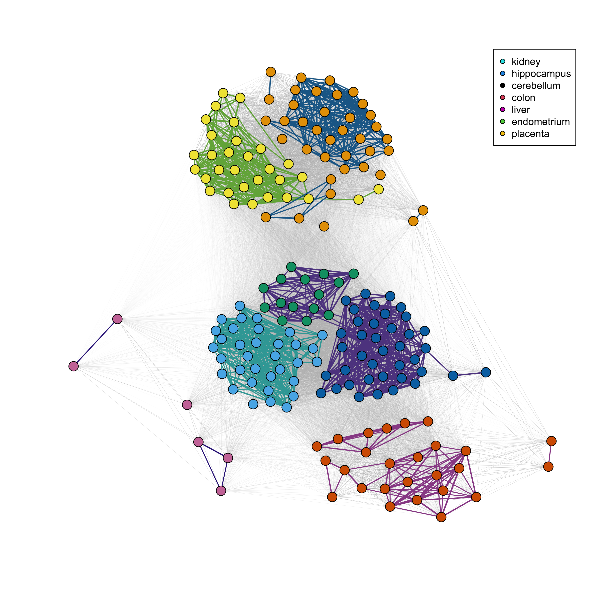
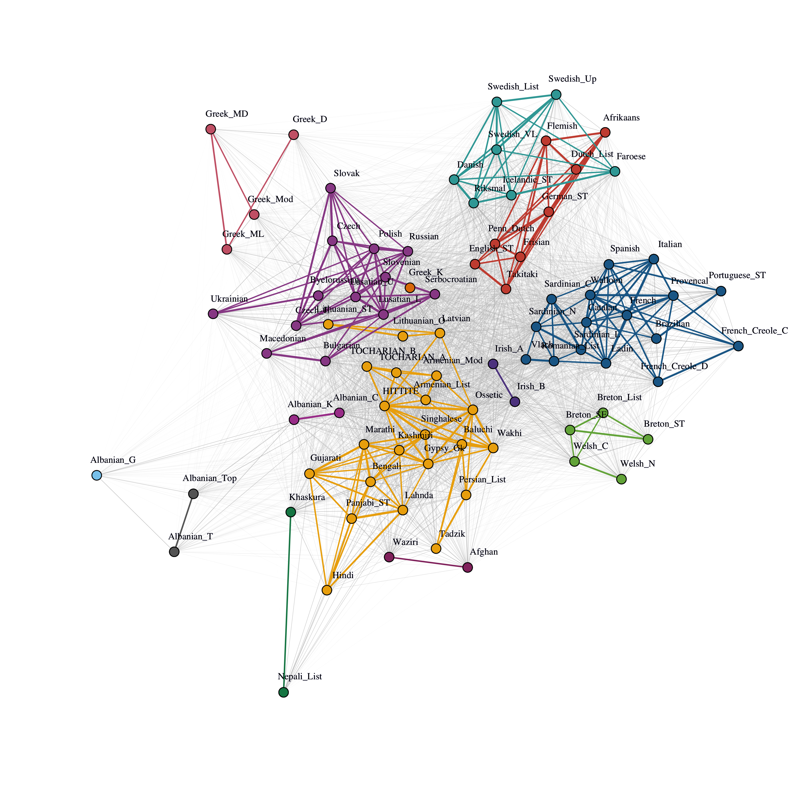
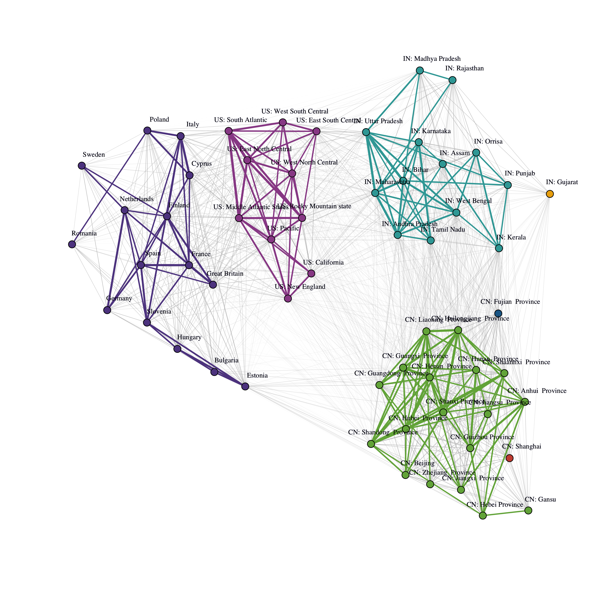

```{r, echo = FALSE}
knitr::opts_chunk$set(fig.height = 4, message = FALSE, warning = FALSE)
```

## Introduction

Partitioned Local Depth (PaLD) is a framework for holistic consideration of community structure for distance-based data.  Leveraging a socially inspired perspective, the method provides network-based community information which is founded on a new measure of local depth and pairwise cohesion (partitioned local depth).  The method does not require distributional assumptions, optimization criteria, nor extraneous inputs.  A complete description of the perspective, together with a discussion of the underlying social motivation, theoretical results, and applications to additional data sets is provided in \citet{berenhaut2022social}. 

Building on existing approaches to (global) depth, local depth expresses features of centrality via an interpretable probability which is free of parameters and robust to outliers.  Then, partitioning the probability which defines local depth, we obtain a measure of cohesion between pairs of individuals.  Both local depth and cohesion reflect aspects of relative position (rather than absolute distance) and provide a straightforward way to account for varying density across the space. As shown in \citet{berenhaut2022social}, provided that two sets are separated (in the sense that the minimum between-set distance is greater than the maximum within-set distance), cohesion is invariant under the contraction and dilation of the distances within each set. This property may be particularly valuable when one has reason to believe that there is heterogeneity in density across the space. 

As cohesion captures a sense of the relationship strength between points, we can then visualize the resulting community structure with a network whose edges are weighted by (mutual) cohesion. The underlying social framework motivates a straightforward yet elegant threshold for distinguishing between strongly and weakly cohesive pairs. 

Networks obtained from cohesion can be displayed using a force-directed graph drawing algorithm; here, we will graphically emphasize strong ties (colored by connected component).  We refer to the connected components of the network of strong ties as community "clusters."  Note that to qualify as a cluster in this definition, one may not have any strong ties with those outside the cluster, and thus the existence of disjoint groups is a strong signal for separation.  Here, clusters are identified without additional user inputs nor optimization criteria.  If one wishes to further break the community graph into groups, one may consider using community detection methods (such as  spectral clustering or the Louvain algorithm), as available, say, in the \CRANpkg{igraph} package.  One may also use the collection of strong ties in place of (weighted) $k$-nearest neighbors in settings such as classification and smoothing.  Overall, the structural information obtained from local depth, cohesion and community graphs can provide a holistic perspective to the data which does not require the use of distributional assumptions, optimization criteria nor additional user inputs.

We present a new package, \CRANpkg{pald}, for calculating Partitioned Local Depth (PaLD) probabilities, implementing community analyses, and creating data visualizations to display community structure. This paper describes how to use the package, walks through several examples, and discusses the approach in the context of commonly used techniques, demonstrating both the novelty of the method and utility of the implementation in the package described.

## pald

The main functions in the \CRANpkg{pald} package can be split into 3 categories:

1. A function for computing the cohesion matrix
2. Functions for extracting useful information from the cohesion matrix, such as local depths, neighbors, community clusters, and graph objects
3. Plotting functions for community graphs

In addition, the package provides a number of pertinent example data sets which may be used to demonstrate community analysis, including a synthetic data set of two-dimensional points created by \citet{gionis1clustering} to demonstrate aggregation, clustering data generated from the scikit-learn Python package \citep{pedregosa2011scikit}, data describing cognate relationships between words across 87 Indo-European languages \citep{dyen92}, data compiled by \cite{tissue} of tissue gene expressions, data emplying information from the World Values Survey \citep{inglehart2014world} on cultural values regarding family, religion, education, and institutions for several regions \citep{muthukrishna2020beyond}, and three example data sets generated for the \citet{berenhaut2022social} paper. 

While it is not a necessity, the \CRANpkg{pald} package is designed to function well with the pipe operator, `|>`. This functionality will be demonstrated below.


### Creating the cohesion matrix

For the purposes of the \CRANpkg{pald} package, the  sole input for the Partitioned Local Depth (PaLD) computations is a distance matrix or `dist` object.  Note that the collection of input distances (or dissimilarities) does not need to satisfy the triangle inequality nor be symmetric. More generally, the method only requires triplet distance comparisons, as opposed to exact numeric distances (see \citet{berenhaut2022social}).

For demonstration purposes, we first show how one can compute a distance matrix from an input data frame with, say, two variables `x1` and `x2`. The input data may be of any dimension; in fact the PaLD framework provides advantages when considering high-dimensional data (see the **Examples** section as well as \citet{berenhaut2022social}). 

```{r}
library(pald)
df <- data.frame(
  x1 = c(6, 8, 8, 16, 4, 14),
  x2 = c(5, 4, 10, 8, 4, 10)
)
rownames(df) <- c("A", "B", "C", "D", "E", "F")
```

The `dist` function returns a (default Euclidean) pairwise distance matrix for an input data frame, as demonstrated below. If the data are already provided as a distance matrix (or `dist` object), the user can skip to the next step. Note that the distance matrix needed for the subsequent functions does not need to be a `dist` object and *need not* be symmetric.

```{r}
d <- dist(df)
```

The function above creates a `dist` object. If converted to a matrix, this will be an $n\times n$ distance matrix, where $n$ corresponds to the number of observations in the original data frame (in this example $n = 6$). 

This `dist` object, or a distance matrix, can then be passed to the `cohesion_matrix` function in order to calculate pairwise cohesion values. 

Cohesion is an interpretable probability that reflects the strength of alignment of two points within local regions. It captures aspects of the relative positioning of points and accounts for varying density across the space (see \citet{berenhaut2022social}).

```{r}
d <- dist(df)
cohesion_matrix(d)
```

Equivalently, the user can use the native pipe `|>` as follows.

```{r}
df |>
  dist() |>
  cohesion_matrix()
```

The _cohesion matrix_ output by the `cohesion_matrix` function is the main input for the majority of the remaining functions.

### Functions for extracting information from the cohesion matrix

From the _cohesion matrix_, a variety of useful quantities can be computed. Below, we create a cohesion matrix using the functions described in the previous section.

```{r}
df |>
  dist() |>
  cohesion_matrix() -> cohesion
```

The `local_depths` function calculates the _depth_ of each point, outputting a vector of local depths. Local depth is an interpretable probability which reflects aspects of relative position and centrality via distance comparisons (e.g., $d(z, x) < d(z, y)$, see \citet{berenhaut2022social}).

```{r}
local_depths(cohesion)
```

In this case, the deepest point is `A`. 

The `strong_threshold` function will calculate the cohesion threshold for strong ties, which reflects typical cohesion for local points (see \citet{berenhaut2022social}). Computationally, this is equal to half the average of the diagonal of the cohesion matrix, and is a threshold that may be used to distinguish between strong and weak ties.

```{r}
strong_threshold(cohesion)
```

In this case, the threshold is a little above `0.117`.

The function `cohesion_strong` will update the cohesion matrix to set all weak ties to zero (via the `strong_threshold` function). Optionally, the matrix will also be symmetrized, using the entry-wise (parallel) minimum of the cohesion matrix and its transpose, with the default parameter `symmetric = TRUE`.

```{r}
cohesion_strong(cohesion)
```


The `community_graphs` function takes the cohesion matrix and creates \CRANpkg{igraph} objects, graphs that describe the (symmetrized) relationship structure between points. This function will output a list of three objects:

* `G`: the weighted (community) graph whose edge weights are mutual cohesion
* `G_strong`: the weighted (community) graph consisting of edges for which mutual (symmetrized) cohesion  (i.e. the minimum of the two directed cohesion values for any given pair) is greater than the threshold for strong ties
* `layout`: the graph layout. By default this is provided by the Fruchterman Reingold (FR) force-directed graph drawing algorithm for the graph `G`, as implemented in the \CRANpkg{igraph} package.

```{r}
graphs <- community_graphs(cohesion)
graphs[["G_strong"]]
```

Here we see that there are three connected components, ties `A-B` and `A-E` form the first community cluster, and the tie `D-F` which forms another.


The `any_isolated()` function will check whether there are any isolated points (according to cohesion).

```{r}
any_isolated(cohesion)
```

\noindent Here, there are no isolated points, i.e. points having zero cohesion with all other points in the data (an extreme form of outlier).

The "community clusters" identified by PaLD are the connected components of the graph of strong ties, `G_strong`. To directly calculate these, we can use the `community_clusters` function. This will output a data frame with two columns; the first corresponds to the `point`, as identified by the row name of the original input data frame, `df`, the second identifies the `community` that the point belongs to.

```{r}
community_clusters(cohesion)
```

In this example, three communities are identified with these six points. Points `A`, `B`, and `E` fall into Community 1. Point `C` is in Community 2 (a community of size 1) and points `D` and `F` fall into Community 3.

## Plotting functions

The final category of function is that for data visualization. We can begin by visualizing the points in the data frame `df` (Figure \ref{fig:fig1}). When visualizing these points, it is important to have the aspect ratio of the x and y axes equal to 1 so as to not distort distances. When using the \CRANpkg{ggplot2} package for this visualization, one can use the command `coord_fixed(ratio = 1)`. If using the `plot` function included in the base library, one can use the `asp = 1` argument.


```{r fig1, fig.cap = "Visualization of the points from the data frame `df`", message = FALSE, warning = FALSE}
library(ggplot2)
ggplot(df, aes(x1, x2)) +
  geom_text(label = rownames(df)) + 
  coord_fixed(ratio = 1) + 
  xlim(c(4, 16)) + 
  ylim(c(4, 16))
```

We can pass the cohesion matrix to the `plot_community_graphs` function to view the relationship between points (Figure \ref{fig:fig2}). The function will also permit parameters that can be passed to `plot.igraph` via the `...` argument. 

```{r fig2, fig.cap = "PaLD graph displaying the relationship between the points in data frame `df`"}
plot_community_graphs(cohesion, 
                      vertex.label.cex = 2,
                      vertex.label.dist = 0.9)
```

Notice in this plot the force-directed layout does not match that of the original data frame as seen in Figure \ref{fig:fig1}. Since our original data is two-dimensional, it may be reasonable to use the latter as the layout for plotting. Figure \ref{fig:fig3} includes this update as well as others addressing some of the aesthetics, such as employing more readable labels. The `layout` argument allows the user to pass a matrix to dictate the 2-dimensional layout of the graph. For example, if we wanted the graph to match the visualization displayed in Figure \ref{fig:fig1}, we could pass `as.matrix(df)` (a matrix of the data frame `df`) to the `layout` argument  (Figure \ref{fig:fig3}). Here, we increase the vertex size and change the vertex label color, through the  argument specifications `vertex.size = 100` and `vertex.label.color = "white"`. Additionally, to allow axes, we use `axes = TRUE`, and to put these back on the original scale we set `rescale = FALSE`, resetting the axis limits using `xlim` and `ylim`. The `par(pty = "s")` function forces the subsequent plot to be square.

```{r fig3, fig.cap = "PaLD graph displaying the relationship between the points in data frame `df`, matching the original layout in Figure 1"}
par(pty = "s")

plot_community_graphs(cohesion, 
                      layout = as.matrix(df),
                      vertex.size = 100,
                      vertex.label.color = "white",
                      axes = TRUE,
                      rescale = FALSE,
                      asp = 1,
                      xlim = c(4, 16),
                      ylim = c(4, 16))
```

## Examples

We will demonstrate the utility of the \CRANpkg{pald} package through several illustrative examples.

### Community analysis for tissue gene expression data

The first example is from a subset of data from \citet{zilliox2007gene}, \citet{mccall2011gene}, and \citet{mccall2014gene}, obtained from the **tissuesGeneExpression** bioconductor package \citep{tissue} consisting of 22,215-dimensional gene expression data from 189 tissue samples. A (Euclidean) `dist` object was created using this data set and is included in the \CRANpkg{pald} package in an object called `tissue_dist`.

The `tissue_dist` object is a `dist` object resulting in a distance matrix with 189 rows and 189 columns.

We can create the cohesion matrix using the `cohesion_matrix` function.

```{r}
tissue_cohesion <- cohesion_matrix(tissue_dist)
```

The `community_clusters` function can be used to identify the community corresponding to each tissue sample. Since the output is a data frame, we can summarize the result using commonly employed R functions. For demonstration purposes, we will use the \CRANpkg{dplyr} package to summarize the community contributions.

```{r}
community_clusters(tissue_cohesion) |>
  dplyr::count(community, point)
```

From this, we can glean, for instance, that Community 1 consists of two types of tissue, the kidney and endometrium, Community 2 is comprised of only the hippocampus, etc. More informatively, we can display relationships between tissue samples, both locally and globally through the `plot_community_graphs` function  (Figure \ref{fig:fig4}). For clarity of the display, we show how to remove the labels using `show_labels = FALSE`. We will instead color according to the labels by passing these to the `vertex.color` argument for the `plot.igraph` function (via the `...` argument). Similarly, we can add a legend using the `legend()` function, as you would for an \CRANpkg{igraph} visualization. Additionally, we use the `edge_width_factor` and `emph_strong` arguments to adjust the width of the lines between and within PaLD communities.

```{r, eval = FALSE}
labels <- rownames(tissue_cohesion)
plot_community_graphs(tissue_cohesion,
                      show_labels = FALSE,
                      vertex.size = 4,
                      vertex.color = as.factor(labels),
                      edge_width_factor = 35,
                      emph_strong = 5) 
legend("topleft", 
       legend = unique(as.factor(labels)), 
       pt.bg = unique(as.factor(labels)),
       col = "black",
       pch = 21)
```

```{r, include = FALSE, output = "hide"}
set.seed(1)
tissue_cohesion <- cohesion_matrix(tissue_dist)
labels <- rownames(tissue_cohesion)
png("fig5.png", res = 300, height = 3000, width = 3000)
plot_community_graphs(tissue_cohesion,
                      show_labels = FALSE,
                      vertex.size = 4,
                      vertex.color = as.factor(labels),
                      edge_width_factor = 35,
                      emph_strong = 5) 
legend("topright", 
       legend = unique(as.factor(labels)), 
       pt.bg = unique(as.factor(labels)),
       col = "black",
       pch = 21)
dev.off()
```


```{r fig4, echo = FALSE, message = FALSE, warning = FALSE, fig.cap = "Community cluster network for the tissue data. The line colors indicate the PaLD communities; the point colors indicate the tissue classification.", out.width = "100%"}

```

Note that while Community 1 does contain kidney and endometrium tissues, the respective sub-communities are well-separated. Of the 357 strong inter-community ties within Community 1, only three are between the two sub-communities. In fact, these are the only strong ties between different tissue types in the community cluster network (of 1064 total); a summary of community strong ties can be produced via the following code. Note that `tissue_graph_strong` is an \CRANpkg{igraph} object corresponding to the graph displayed in Figure \ref{fig:fig4}, restricted only to strong ties.

```{r}
tissue_graphs <- community_graphs(tissue_cohesion)
tissue_graph_strong <- tissue_graphs[["G_strong"]]
E <- igraph::get.edgelist(tissue_graph_strong)
table(apply(E, 1, paste, collapse = ","))
```


## Cognate-based Language Families 

This example explors a data set from \citet{dyen92} that summarizes relationships between 87 Indo-European languages from the perspective of cognates, coded using 2,655-dimensional binary vectors. A `dist` object was created from this data set and is included in the \CRANpkg{pald} package in an object called `cognate_dist`.

Here we will demonstrate how one can further apply functions in the \CRANpkg{igraph} package to objects output from the \CRANpkg{pald} package. We can first use the `cohesion_matrix` function to calculate the cohesion matrix and the `community_graphs` function to create a list with the weighted community graph, the weighted community graph with only strong ties included, and the layout. From this, we can extract the graph with only the strong ties, here called `cognate_graph_strong`.

```{r}
cognate_cohesion <- cohesion_matrix(cognate_dist)
cognate_graphs <- community_graphs(cognate_cohesion)

cognate_graph_strong <- cognate_graphs[["G_strong"]]
```

We can then use the `neighbors` function from the \CRANpkg{igraph} package to extract the strong neighbors in this graph. For example, we can extract all neighbors for the language "French", via the followign code.

```{r}
french_neighbors <- igraph::neighbors(cognate_graph_strong, "French")
french_neighbors
```

Similarly, we can print the associated neighborhood weights by subsetting the cohesion matrix.

```{r}
cognate_cohesion["French", french_neighbors]
```

We can again use the `plot_community_graphs` function to visualize the community clusters (Figure \ref{fig:figlang}). One may note the commonly identifiable language clusters and that, under a slight rotation, some of the underlying geography is mirrored in the plot.

```{r, eval = FALSE}
plot_community_graphs(
  cognate_cohesion,
  edge_width_factor = 30,
  emph_strong = 3,
  vertex.size = 3,
  vertex.label.cex = 0.7,
  vertex.label.dist = 1
)
```

```{r, include = FALSE, output = "hide"}
set.seed(7)
png("fig6.png", res = 300, height = 3000, width = 3000)
plot_community_graphs(
  cognate_cohesion,
  edge_width_factor = 30,
  emph_strong = 3,
  vertex.label.cex = 0.7,
  vertex.size = 3,
  vertex.label.dist = 1
)
dev.off()
```


```{r figlang, echo = FALSE, message = FALSE, warning = FALSE, fig.cap = "Community structure for 87 Indo-European languages, which employs cognate information that was coded via 2,665-dimensional binary vectors. Commonly identifiable language clusters arise along with informative inter- and intra-cluster structure. Several ancient languages are centrally located.", out.width = "100%"}

```

### Community analysis for generated data

The \CRANpkg{pald} package includes three randomly generated data frames corresponding to plots from \citet{berenhaut2022social}: 

* `exdata1` is a data set consisting of 8 points used to create Figure 1 in \citet{berenhaut2022social} 
* `exdata2` is a data set consisting of 16 points used to create Figure 2 in \citet{berenhaut2022social} 
* `exdata3` is a data set consisting of 240 points used to create Figure 4D in \citet{berenhaut2022social} 

Here, we will demonstrate how to use `exdata3`. These points were generated from bivariate normal distributions with varying means and variances. There are eight "true" communities.

We will contrast community analysis via PaLD to standard culuster analysis by considering two common clustering methods. The code below calculates the cohesion matrix (`exdata_cohesion`) as well as the community clusters obtained via PaLD (`exdata_pald`), along with clusters obtained via *k*-means (`exdata_kmeans`) and hierarchical clustering using complete linkage (`exdata_hclust`).

```{r}
exdata_cohesion <- exdata3 |>
  dist() |>
  cohesion_matrix()

exdata_pald <- community_clusters(exdata_cohesion)$cluster

exdata_kmeans <- kmeans(exdata3, 8)$cluster

exdata_hclust <- exdata3 |>
  dist() |>
  hclust() |>
  cutree(k = 8) 
```

The information is displayed in Figure \ref{fig:fig5}.

```{r fig5, fig.cap = "PaLD, k-means, and hierarchical 8-clustering of randomly generated example data (from \\citet{berenhaut2022social}; Figure 4D)."}
par(mfrow = c(1, 3), pty = "s")
plot(
  exdata3,
  pch = 16,
  col = pald_colors[exdata_pald],
  xlab = "",
  ylab = "",
  main = "PaLD Communities",
  asp = 1
)
plot(
  exdata3,
  pch = 16,
  col = pald_colors[exdata_kmeans],
  xlab = "",
  ylab = "",
  main = "K-Means Clusters (k = 8)",
  asp = 1
)
plot(
  exdata3,
  pch = 16,
  col = pald_colors[exdata_hclust],
  xlab = "",
  ylab = "",
  main = "Hiearchical Clusters (k = 8)",
  asp = 1
)
```

Cohesion is particularly useful when considering data with varying local density; see \citet{berenhaut2022social} for further examples, discussion, and theoretical results.  Note that the PaLD algorithm is able to detect the eight natural groups within the data  (along with inter- and intra-community structure not displayed here) without the use of any additional inputs (e.g., number of clusters) nor optimization criteria.  Despite the user input of the "correct" number of clusters (i.e., $k = 8$) both *k*-means and hierarchical clustering do not provide the desired result. 

### Cultural and Pyschological distance analysis

In this example we perform a PaLD analysis for cultural distances obtained in \citet{muthukrishna2020beyond} from two recent waves of the World Values Survey (2005 to 2009 and 2010 to 2014; see \citet{inglehart2014world}). Distances are
computed using the cultural fixation index (CFST), which is a measure built on the framework of fixation indices from population
biology (\citet{bell2009culture,cavalli1994history}). Recall that the foundation of PaLD in within-triplet comparisons allows for the employment of application-dependent and non-Euclidean measures of dissimilarity.
The `dist` object is
included in the \CRANpkg{pald} package (`cultures`). We will first create the cohesion matrix using the `dist` object `cultures`, and proceed to plot the community graph.

```{r}
cultures_cohesion <- cohesion_matrix(cultures)
```

```{r, eval = FALSE}
plot_community_graphs(
  cultures_cohesion,
  edge_width_factor = 30,
  emph_strong = 3,
  vertex.label.cex = 0.7,
  vertex.size = 3,
  vertex.label.dist = 1
)
```


```{r, include = FALSE, results = "hide"}
set.seed(7)
png("fig7.png", res = 300, height = 3000, width = 3000)
plot_community_graphs(
  cultures_cohesion,
  edge_width_factor = 30,
  emph_strong = 3,
  vertex.label.cex = 0.7,
  vertex.size = 3,
  vertex.label.dist = 1
)
dev.off()
```

```{r figculture, echo = FALSE, message = FALSE, warning = FALSE, fig.cap = "Community structure for cultural distance data.", out.width = "100%"}

```

In addition to viewing the local and global community structure as seen in Figure \ref{fig:figculture}, the \CRANpkg{pald} package allows for a two-dimensional display of cohesion against distance for the data, via the `dist_cohesion_plot` function, as seen below (Figure \ref{fig:figco}). 

```{r figco, fig.cap = "A plot of cohesion versus distance for the data. The identified communities are colored as in Figure \\ref{fig:figculture}."}
dist_cohesion_plot(cultures, mutual = TRUE)
```

Notice here that the magnitude of the distances within each of the identified communities varies substantially between regions; in fact, the most disparate two regions in the United States (at distance $\approx$ 0.027) are far closer than the two most similar in India (at distance $\approx$ 0.043). Despite this, India remains a cohesive whole, and locally disparate regions in the United States such as East South Central and California are not strongly cohesive. For discussion of subtleties in local density (see \citet{berenhaut2022social}. Additionally, currently available techniques require specification of parameters, as seen in the previous section. For further discussion of the cultural distance data in relation to community analysis see \citet{berenhaut2022social}.

## Summary

This paper introduces the \CRANpkg{pald} package, demonstrating its utility for providing parameter-free community analysis which can easily be implemented for a variety of data sets, supplementing results from other methods for clustering, embedding, nearest neighbors, etc. Example code is provided advantages over other techniques are highlighted.

\bibliography{RJreferences}
