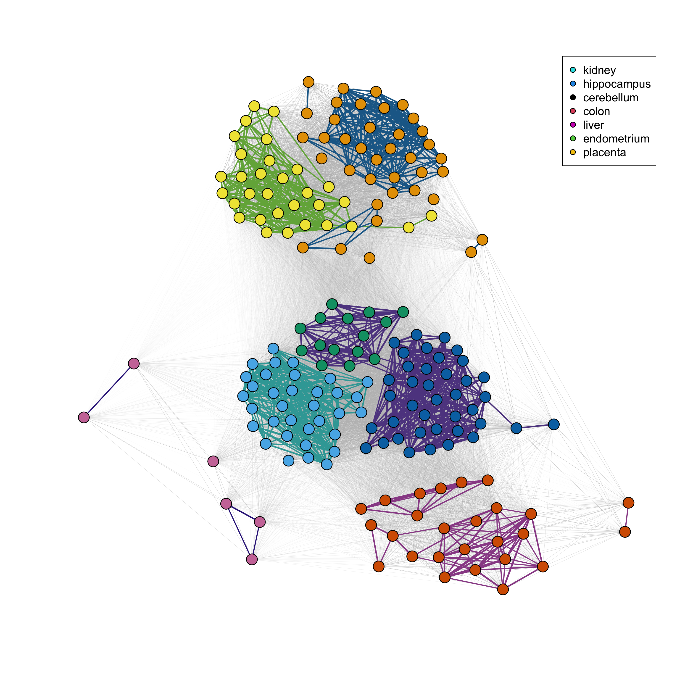

```{r, echo = FALSE}
knitr::opts_chunk$set(fig.height = 4, message = FALSE, warning = FALSE)
```

## Introduction

Partitioned Local Depths (PaLD) is a framework for a holistic consideration of the community structure of distance-based data.  Leveraging a socially inspired perspective, the method provides network-based community information which is founded on a new measure of local depth and pairwise cohesion (partitioned local depth).  The method does not require distributional assumptions, optimization criteria, nor extraneous inputs.  A complete description of the perspective, together with a discussion of the underlying social motivation, theoretical results, and applications to additional data sets is provided in \citet{berenhaut2022social}. 

Building on existing approaches to (global) depth, local depth expresses features of centrality as an interpretable probability which is free of parameters and robust to outliers.  Then, partitioning the probability which defines local depth, we obtain a measure of cohesion between pairs of points.  Both local depth and cohesion reflect aspects of relative position (rather than absolute distance) and provide a straightforward way to account for varying density across the space. Specifically, as shown in \citet{berenhaut2022social}, provided that two sets are separated (in the sense that the minimum between-set distance is greater than the maximum within-set distance), cohesion is invariant under the contraction and dilation of the distances within each set. This property may be particularly valuable when one has reason to believe that the magnitude of distances varies across the space. 

As cohesion captures a sense of the relationship strength between points, we can then visualize the resulting community structure with a network whose edges are weighted by (mutual) cohesion. The underlying social framework motivates an elegant threshold for distinguishing between strongly and weakly cohesive pairs. 

As seen throughout this paper, we display the network obtained from cohesion using a force-directed graph drawing algorithm and emphasize the strong ties (colored by connected component).  We refer to the connected components of the network of strong ties as community "clusters."  Note that to qualify as a cluster in this definition, one may not have any strong ties with those outside the cluster, and thus the existence of disjoint groups is a strong signal for separation.  Here, clusters are identified without additional user inputs nor optimization criteria.  If one wishes to further break the community graph into groups, one may use community detection methods for networks (such as spectral clustering or the Louvain algorithm).  Though only briefly considered here, one may also use the collection of strong ties in place of (weighted) k-nearest neighbors in settings such as classification and smoothing.  Overall, the structural information obtained from local depth, cohesion and community graphs can provide a holistic perspective on the data which does not require the use of distributional assumptions, optimization criteria nor additional user inputs.

We present a new package, \CRANpkg{pald}, for calculating Partitioned Local Depths (PaLD) probabilities, implementing clustering analyses, and creating data visualizations to display community structure. This paper will describe how to use the package as well as walk through several examples.

## pald

The main functions in the \CRANpkg{pald} package can be split into 3 categories:

1. A function for computing the cohesion matrix
2. Functions for extracting useful information from the cohesion matrix, such as local depths, neighbors, clusters, and graph objects
3. Plotting functions for community graphs

In addition, the package provides a number of pertinent example data sets commonly used to demonstrate cluster algorithms, including a synthetic data set of two-dimensional points created by \citet{gionis1clustering} to demonstrate clustering aggregation, clustering data generated from the scikit-learn Python package \citep{pedregosa2011scikit}, data describing cognate relationships between words across 87 Indo-European languages \citep{dyen92}, data compiled by \cite{tissue} of tissue gene expressions, and three example data sets generated for the \citet{berenhaut2022social} paper. 

While it is not a necessity, the \CRANpkg{pald} package is designed to function well with the pipe operator, `|>`. This functionality will be demonstrated below.


### Creating the cohesion matrix

The input for the Partitioned Local Depths (PaLD) is a distance matrix or `dist` object.  Note that the collection of input distances (or dissimilarities) does not need to satisfy the triangle inequality.  

For demonstration purposes, we will show how one can compute a distance matrix from an input data frame with, say, two variables `x1` and `x2`. The input data may be of any dimension. The methods put forth here work on data frames with higher dimensions, as described in the **Examples** section; we are simply choosing a small data frame here for demonstration purposes.

```{r}
library(pald)
df <- data.frame(
  x1 = c(6, 8, 8, 16, 4, 14),
  x2 = c(5, 4, 10, 8, 4, 10)
)
rownames(df) <- c("A", "B", "C", "D", "E", "F")
```

The `dist()` function converts an input data frame into a distance matrix, as demonstrated below. If the data are already provided as a distance matrix (or `dist` object), the user can skip to the next step. 

```{r}
d <- dist(df)
```

The function above creates a `dist` object. If converted to a matrix, this will be a $n\times n$ distance matrix, where $n$ corresponds to the number of observations in the original data frame, in this example $n = 6$. 

This `dist` object, or a distance matrix, can then be passed to the `cohesion_matrix()` function in order to calculate the pairwise cohesion values. 

Cohesion is an interpretable probability that reflects the strength of alignment of two points within local regions. It captures aspects of the relative positioning of points and accounts for varying density across the space.

```{r}
d <- dist(df)
cohesion_matrix(d)
```

Equivalently, the user can use the native pipe `|>` as follows.

```{r}
df |>
  dist() |>
  cohesion_matrix()
```

The _cohesion matrix_ output by the `cohesion_matrix()` function is the main input for the majority of the remaining functions.

### Functions for extracting information from the cohesion matrix

From the _cohesion matrix_, a variety of useful quantities can be calculated. Below, we create a cohesion matrix using the functions described in the previous section.

```{r}
df |>
  dist() |>
  cohesion_matrix() -> cohesion
```

The `local_depths()` function calculates the _depths_ of each point, outputting a vector of local depths. Local depth is an interpretable probability which reflects aspects of relative position and centrality via distance comparisons (i.e., $d(z, x) < d(z, y)$).

```{r}
local_depths(cohesion)
```

In this case, the deepest point is `A`. 

The `strong_threshold()` function will calculate the cohesion threshold for strong ties. This is equal to half the average of the diagonal cohesion matrix.\citep{berenhaut2022social} This is a threshold that may be used to distinguish between strong and weak ties.

```{r}
strong_threshold(cohesion)
```

In this case, the threshold is `0.117`.

The function `cohesion_strong()` will update the cohesion matrix to set all weak ties to zero (via the `strong_threshold()` function). Optionally, the matrix will also be symmetrized, using the entry-wise (parallel) minimum of the cohesion matrix and its transpose, with the default parameter `symmetric = TRUE`.

```{r}
cohesion_strong(cohesion)
```


The `community_graphs()` function takes the cohesion matrix and creates \CRANpkg{igraph} objects, graphs that describe the relationship between the points. This function will output a list of three objects:

* `G`: the weighted (community) graph whose edge weights are mutual cohesion
* `G_strong`: the weighted (community) graph consisting of edges for which mutual cohesion is greater than the threshold for strong ties
* `layout`: the graph layout, using the Fruchterman Reingold (FR) force-directed graph drawing for the graph `G`

```{r}
graphs <- community_graphs(cohesion)
graphs[["G_strong"]]
```

Here we see that there are three connected components, ties `A-B` and  and `A-E` which form the first cluster, and the tie `D-F` which forms another.


The `any_isolated()` function will check whether there are any isolated points that will inadvertently be dropped by a graph.

```{r}
any_isolated(cohesion)
```

Here, there are no isolated points.

The "clusters" identified by PaLD are the connected components of the graph of strong ties, `G_strong`. To directly calculate them, we can use the `community_clusters()` function. This will output a data frame with two columns, the first will correspond to the `point`, as identified by the row name of the original input data frame, `df`, the second will identify the `cluster` that each point belongs to.

```{r}
community_clusters(cohesion)
```

In this example, three clusters are identified with these six points. Points `A`, `B`, and `E` fall into cluster 1. Point `C` is in cluster 2 and points `D` and `F` fall into cluster 3.

## Plotting functions

The final category of function is functions for data visualization. We can begin by visualizing the points in data frame `df` (Figure \ref{fig:fig1}). When visualizing these points, it is important to have the aspect ratio of the x and y axes equal to 1 so as to not distort the distances. When using the \CRANpkg{ggplot2} package for this visualization, you can use the `coord_fixed(ratio = 1)` function. If using the `plot()` function included in the base library, you can use the `asp = 1` argument.


```{r fig1, fig.cap = "Visualize the points from data frame `df`", message = FALSE, warning = FALSE}
library(ggplot2)
ggplot(df, aes(x1, x2)) +
  geom_text(label = rownames(df)) + 
  coord_fixed(ratio = 1) + 
  xlim(c(4, 16)) + 
  ylim(c(4, 16))
```

We can pass the cohesion matrix to the `plot_community_graphs()` function to view the relationship between points (Figure \ref{fig:fig2}).

```{r fig2, fig.cap = "PaLD graph displaying the relationship between the points in data frame `df`"}
plot_community_graphs(cohesion)
```

The `layout` argument allows the user to pass a matrix to dictate the 2-dimensional layout of the graph. For example, if we wanted the graph to match the visualization displayed in Figure \ref{fig:fig1}, we can pass `as.matrix(df)`, or a matrix of the data frame `df` to the `layout` argument  (Figure \ref{fig:fig3}). Additionally, this `plot_community_graphs()` function will also permit parameters that can be passed to the `plot.igraph()` function. For example, we can pass arguments to the `plot.igraph` function via `...`, for example to increase the vertex size and change the vertex label color, we can specify `vertex.size = 100` and `vertex.label.color = "white"`. Additionally, to allow axes, we use `axes = TRUE` and to put them back on the original scale we set `rescale = FALSE`, resetting the axis limits using `xlim` and `ylim`. The `par(pty = "s")` function forces the subsequent plot to be square.

```{r fig3, fig.cap = "PaLD graph displaying the relationship between the points in data frame `df`, matching the original layout in Figure 1"}
par(pty = "s")

plot_community_graphs(cohesion, 
                      layout = as.matrix(df),
                      vertex.size = 100,
                      vertex.label.color = "white",
                      axes = TRUE,
                      rescale = FALSE,
                      asp = 1,
                      xlim = c(4, 16),
                      ylim = c(4, 16))
```

## Examples

We will demonstrate the utility of the \CRANpkg{pald} package in three clustering examples.

### Clustering tissue gene expression data

The first example is from a subset of tissue gene expression data from \citet{zilliox2007gene}, \citet{mccall2011gene}, and \citet{mccall2014gene}, obtained from the **tissuesGeneExpression** bioconductor package \citep{tissue}. A `dist` object was created using this data set and is included the \CRANpkg{pald} package in an object called `tissue_dist`.

The `tissue_dist` object is a `dist` object resulting in a distance matrix with 189 rows and 189 columns.

We can create the cohesion matrix using the `cohesion_matrix` function.

```{r}
tissue_cohesion <- cohesion_matrix(tissue_dist)
```

The `community_clusters()` function can be used to identify the clusters of each tissue sample. Since the output is a data frame, we can summarize the clusters using commonly used data analysis techniques. For demonstration purposes, we will use the \CRANpkg{dplyr} package to summarize the contribution of clusters.

```{r}
community_clusters(tissue_cohesion) |>
  dplyr::count(cluster, point)
```

From this, we can glean that cluster one consists of two types of tissue, the kidney and endometrium. Cluster two is comprised of only the hippocampus. 

We can also display the relationships between tissue samples using the `plot_community_graphs()` function (Figure \ref{fig:fig4}). For clarity of the display, we show how to remove the labels using `show_labels = FALSE`. We will instead color by the labels by passing these to the `vertex.color` parameter through the  `...` to the `plot.igraph` function. Similarly, we can add a legend using the `legend()` function, as you would for an \CRANpkg{igraph} visualization. Additionally, we use the `edge_width_factor` and `emph_strong` arguments to adjust the width of the lines between and within PaLD clusters.

```{r, eval = FALSE}
labels <- rownames(tissue_cohesion)
plot_community_graphs(tissue_cohesion,
                      show_labels = FALSE,
                      vertex.size = 4,
                      vertex.color = as.factor(labels),
                      edge_width_factor = 35,
                      emph_strong = 5) 
legend("topleft", 
       legend = unique(as.factor(labels)), 
       pt.bg = unique(as.factor(labels)),
       col = "black",
       pch = 21)
```

```{r, include = FALSE, output = "hide"}
set.seed(1)
tissue_cohesion <- cohesion_matrix(tissue_dist)
labels <- rownames(tissue_cohesion)
png("fig5.png", res = 300, height = 3000, width = 3000)
plot_community_graphs(tissue_cohesion,
                      show_labels = FALSE,
                      vertex.size = 4,
                      vertex.color = as.factor(labels),
                      edge_width_factor = 35,
                      emph_strong = 5) 
legend("topright", 
       legend = unique(as.factor(labels)), 
       pt.bg = unique(as.factor(labels)),
       col = "black",
       pch = 21)
dev.off()
```


```{r fig4, echo = FALSE, message = FALSE, warning = FALSE, fig.cap = "Community cluster network for the tissue data. The line colors indicate the PaLD clusters, the point colors indicate the tissue classification.", out.width = "100%"}

```

## Cognate-based Language Families 

This example performs a PaLD analysis on a data set from \citet{dyen92} that examines the relationship between 87 Indo-European languages from the perspective of cognates. A `dist` object was created from this data set and included in the \CRANpkg{pald} package in an object called `cognate_dist`.

This example will demonstrate how you can apply functions in the \CRANpkg{igraph} package to objects output from the \CRANpkg{pald} package. We can first use the `cohesion_matrix()` function to calculate the cohesion matrix and the `community_graphs()` function to create a list with the weighted community graph, the weighted community graph with only strong ties included (and all others set to 0), and the layout. From this, we can extract the graph with only the strong ties, here called `cognate_graph_strong`.

```{r}
cognate_cohesion <- cohesion_matrix(cognate_dist)
cognate_graphs <- community_graphs(cognate_cohesion)

cognate_graph_strong <- cognate_graphs[["G_strong"]]
```

We can then use the `neighbors()` function from the \CRANpkg{igraph} package to extract the strong neighbors in this graph. For example, if we wanted to extract all neighbors where the language is "French", we would run the following.

```{r}
french_neighbors <- igraph::neighbors(cognate_graph_strong, "French")
french_neighbors
```

Similarly, we can print the associated neighborhood weights by subsetting the cohesion matrix.

```{r}
cognate_cohesion["French", french_neighbors]
```


### Clustering generated data

The \CRANpkg{pald} package includes three randomly generated data frames corresponding to plots from @berenhaut2022social: 

* `exdata1` is a data set consisting of 8 points to recreate Figure 1 in @berenhaut2022social 
* `exdata2` is a data set consisting of 16 points to recreate Figure 2 in @berenhaut2022social 
* `exdata3` is a data set consisting of 240 points to recreate Figure 4D in @berenhaut2022social 

Here, we will demonstrate how to use `exdata3`. These points were generated from bivariate normal distributions with varying means and variances. There are eight "true" clusters.

We will demonstrate how we can compare PaLD to two clustering methods: *k*-means and hierarchical clustering. The code below calculates the cohesion matrix (`exdata_cohesion`) as well as the clusters via PaLD (`exdata_pald`), *k*-means (`exdata_kmeans`) and hierarchical clustering using complete linkage (`exdata_hclust`).

```{r}
exdata_cohesion <- exdata3 |>
  dist() |>
  cohesion_matrix()

exdata_pald <- community_clusters(exdata_cohesion)$cluster

exdata_kmeans <- kmeans(exdata3, 8)$cluster

exdata_hclust <- exdata3 |>
  dist() |>
  hclust() |>
  cutree(k = 8) 
```


We can compare this to the clustering generated by *k*-means and hierarchical clustering (Figure \ref{fig:fig5}).

```{r fig5, fig.cap = "PaLD clustering of randomly generated example data (from Figure 4D from Berenhaut et al. (2022)) compared to k-means and hierarchical clustering with k = 8."}
par(mfrow = c(1, 3), pty = "s")
plot(
  exdata3,
  pch = 16,
  col = pald_colors[exdata_pald],
  xlab = "",
  ylab = "",
  main = "PaLD Clusters",
  asp = 1
)
plot(
  exdata3,
  pch = 16,
  col = pald_colors[exdata_kmeans],
  xlab = "",
  ylab = "",
  main = "K-Means Clusters (k = 8)",
  asp = 1
)
plot(
  exdata3,
  pch = 16,
  col = pald_colors[exdata_hclust],
  xlab = "",
  ylab = "",
  main = "Hiearchical Clusters (k = 8)",
  asp = 1
)
```

Cohesion is particularly useful when considering data with varying local density, see discussion in [@berenhaut2022social].  Note that the PaLD algorithm is able to detect the eight natural groups within the data without the use of any additional inputs (e.g., number of clusters) nor optimization criteria.  Despite providing the "correct" number of clusters (i.e., $k = 8$) both *k*-means and hierarchical clustering did not give the desired result.  

## Summary

This paper introduces the \CRANpkg{pald} package, demonstrating its utility for providing parameter-free clustering which can easily be implemented for a variety of data sets.

\bibliography{RJreferences}
